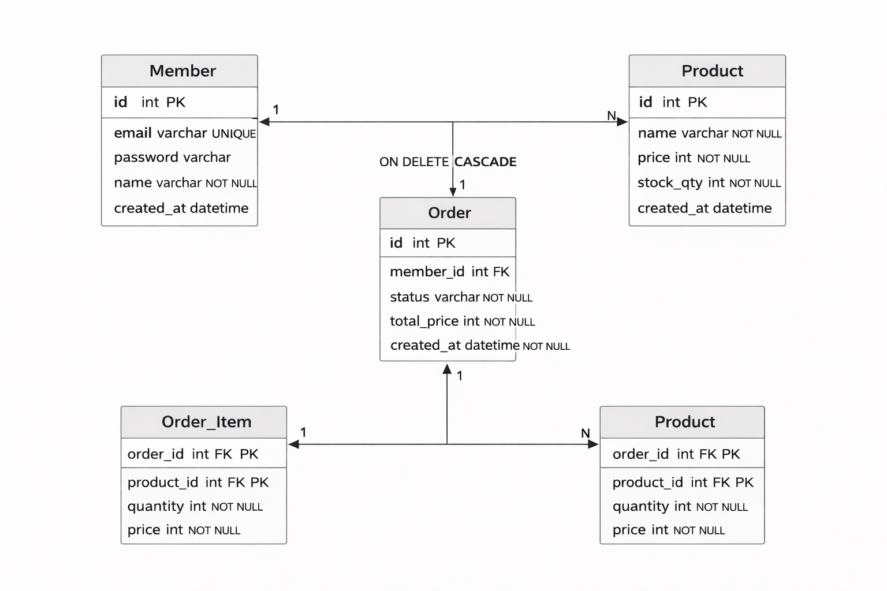

# 03. ERD

## 1. ERD Diagram

---

## 2. 설계 의도 설명

### 1) Member - Order (1:N)
- 한 명의 회원은 여러 개의 주문을 생성할 수 있다.
- Order 테이블에 member_id FK를 둔다.

### 2) Order - OrderItem (1:N)
- 하나의 주문은 여러 개의 상품을 포함할 수 있다.
- 다대다 관계를 해결하기 위해 OrderItem을 중간 테이블로 둔다.

### 3) Product - OrderItem (1:N)
- 하나의 상품은 여러 주문에 포함될 수 있다.
- OrderItem에 product_id FK를 둔다.

### 4) OrderItem에 price를 저장한 이유
- 주문 시점의 가격을 보존하기 위함
- 상품 가격이 변경되더라도 과거 주문 데이터는 유지되어야 한다.

---

## 3. 정규화 전략

- 3NF 기준으로 설계
- 중복 데이터 최소화
- 주문 상세는 별도 테이블로 분리

---

## 4. 향후 확장 고려

- Coupon 테이블 추가 가능
- Payment 테이블 분리 가능
- Delivery 테이블 확장 가능
