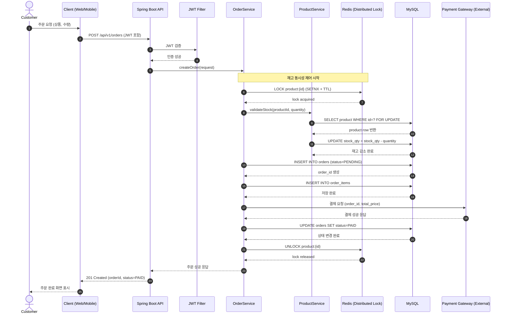
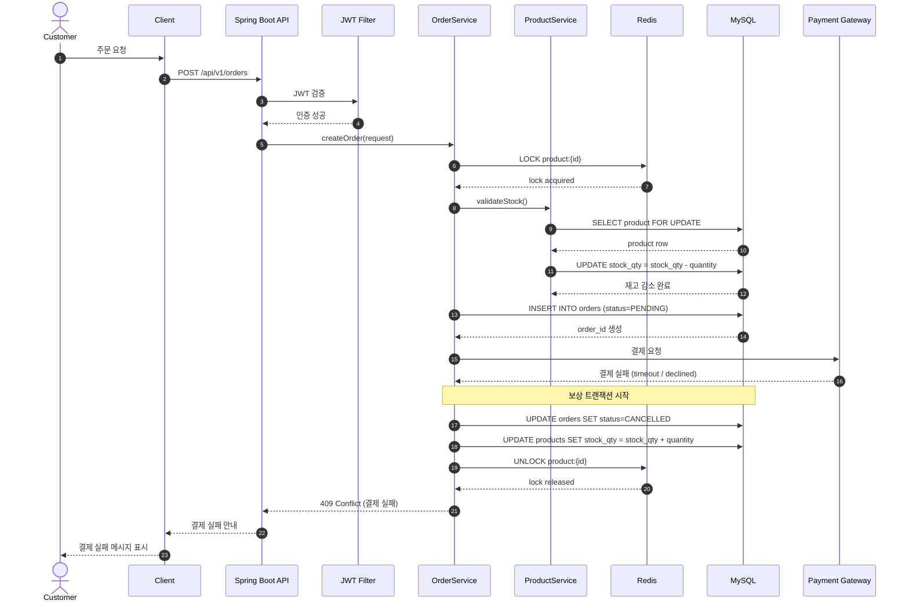

# 05. Sequence Diagram

이 문서는 ShopSphere 이커머스 시스템의 핵심 기능인 
"주문 생성" 프로세스의 정상 흐름과 예외 흐름을 설명한다.

---

# 1. 주문 생성 - 결제 성공 시퀀스

---

# 2. 주문 생성 - 결제 실패 시퀀스

---

# 3. 설계 의도 설명

## 1) 상태 전이 기반 주문 관리

주문은 다음과 같은 상태 흐름을 가진다:

- PENDING → PAID (정상 결제)
- PENDING → CANCELLED (결제 실패)

결제 성공 이전에는 반드시 PENDING 상태로 유지하여,
결제 실패 시 보상 트랜잭션이 가능하도록 설계하였다.

---

## 2) 재고 동시성 제어 전략

이커머스 시스템에서는 동일 상품에 대한 동시 주문이 발생할 수 있다.

이를 해결하기 위해:

- Redis 기반 분산 락 사용
- TTL을 설정하여 데드락 방지
- DB 레벨에서도 FOR UPDATE 또는 낙관적 락 적용 가능

이중 보호 전략을 고려하였다.

---

## 3) Order와 OrderItem 분리 이유

- 하나의 주문에 여러 상품이 포함될 수 있음
- 다대다 관계를 해소하기 위해 중간 테이블(OrderItem) 설계
- OrderItem에 가격을 저장하여 주문 시점 가격 보존

---

## 4) 결제 실패 시 보상 트랜잭션

외부 결제 시스템은 실패 가능성이 존재한다.

따라서:
- 주문 상태를 CANCELLED로 변경
- 차감했던 재고를 복구
- 락을 해제

이를 통해 데이터 정합성을 유지한다.

---

## 5) 확장 고려 사항

향후 트래픽 증가 시:

- Redis 클러스터 구성
- 읽기/쓰기 DB 분리 (Read Replica)
- 주문 처리 비동기화 (Kafka 등 도입 가능)

현재 구조는 이러한 확장을 고려하여 설계되었다.
