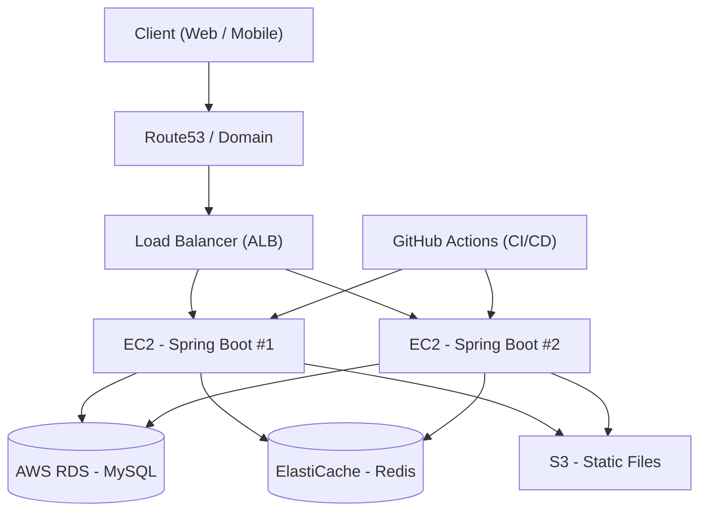

# 09. Deployment Architecture

본 프로젝트는 AWS 기반 단일 리전 환경을 가정하여 설계하였다.
확장 가능성을 고려하되, 초기 스타트업 수준의 현실적인 구조를 목표로 한다.

---

## 1. 배포 아키텍처 다이어그램



---

## 2. 구성 요소 설명

### 1) Client
- Web 브라우저 또는 모바일 앱
- HTTPS 기반 요청

---

### 2) DNS / Load Balancer

- Route53: 도메인 관리
- Application Load Balancer:
  - 트래픽 분산
  - SSL 종료 처리
  - 서버 헬스 체크

---

### 3) Application Server

- EC2 인스턴스 2대
- Spring Boot 애플리케이션 실행
- Auto Scaling 적용 가능

수평 확장(Scale-Out)을 고려한 구조

---

### 4) Database

- AWS RDS (MySQL)
- Multi-AZ 설정 가능
- 자동 백업

---

### 5) Cache

- AWS ElastiCache (Redis)
- 재고 동시성 제어
- 상품 조회 캐싱

---

### 6) 정적 파일 저장

- S3에 이미지 업로드
- CloudFront 연동 가능

---

### 7) CI/CD

- GitHub Actions 사용
- main 브랜치 merge 시 자동 배포
- Docker 이미지 빌드 후 EC2 배포

---

## 3. Docker 기반 배포 전략

### Dockerfile 예시

```dockerfile
FROM openjdk:17
COPY build/libs/app.jar app.jar
ENTRYPOINT ["java","-jar","/app.jar"]
```

---

## 4. 무중단 배포 전략 (선택)

- Rolling Update
- Blue-Green 배포 가능

---

## 5. 확장 전략

### 트래픽 증가 시

- EC2 Auto Scaling
- RDS Read Replica
- Redis Cluster

### 대규모 전환 시

- MSA 전환
- Kafka 도입
- Kubernetes 적용

---

## 6. 설계 의도

- 단일 서버 구조가 아닌, 수평 확장이 가능한 구조 채택
- DB와 애플리케이션 분리
- 캐시 계층 분리
- CI/CD 자동화로 운영 효율 확보

본 구조는 스타트업 초기 단계에서 현실적으로 구현 가능한 수준이며,
향후 트래픽 증가 시 확장이 용이하도록 설계하였다.
